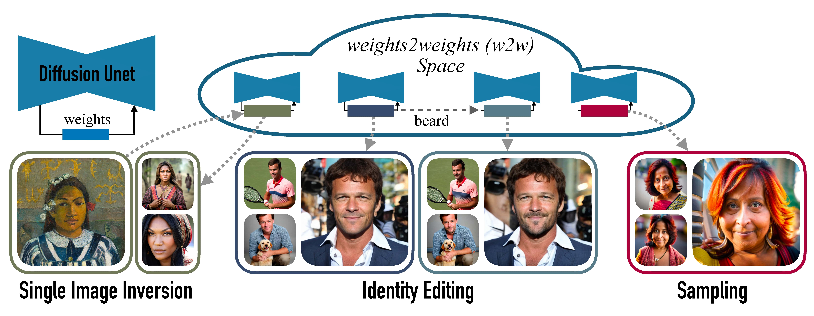

# Interpreting the Weight Space of Customized Diffusion Models (*NeurIPS 2024*)
[[Paper](https://arxiv.org/abs/2406.09413)] [[Project Page](https://snap-research.github.io/weights2weights/)] [[Demo](https://huggingface.co/spaces/snap-research/weights2weights)] [[Files](https://huggingface.co/snap-research/weights2weights)]

Official implementation of the paper "Interpreting the Weight Space of Customized Diffusion Models" (aka *weights2weights*). 



>We investigate the space of weights spanned by a large collection of customized diffusion models. We populate this space by creating a dataset of over 60,000 models, each of which is a base model fine-tuned to insert a different person's visual identity. We model the underlying manifold of these weights as a subspace, which we term <em>weights2weights</em>. We demonstrate three immediate applications of this space that result in new diffusion models -- sampling, editing, and inversion. First, sampling a set of weights from this space results in a new model encoding a novel identity. Next, we find linear directions in this space corresponding to semantic edits of the identity (e.g., adding a beard), resulting in a new model with the original identity edited. Finally, we show that inverting a single image into this space encodes a realistic identity into a model, even if the input image is out of distribution (e.g., a painting). We further find that these linear properties of the diffusion model weight space extend to other visual concepts. Our results indicate that the weight space of fine-tuned diffusion models can behave as an interpretable <em>meta</em>-latent space producing new models. 

## Setup
### Environment
Our code is developed in `PyTorch 2.3.0` with `CUDA 12.1`, `torchvision=0.18.0`, and `python=3.12.3`.

To replicate our environment, install [Anaconda](https://docs.anaconda.com/free/anaconda/install/index.html), and run the following commands.
```
$ conda create -n w2w
$ conda activate w2w
$ conda install pip
$ pip install -r requirements.txt
```

### Files
The Hugging Face model card is available at this [link](https://huggingface.co/Snapchat/weights2weights). You can find info on all the files there.

The files needed to create *w2w* space, load models, train classifiers, etc. can be downloaded at this [link](https://huggingface.co/Snapchat/weights2weights/tree/main/files), or [here](https://drive.google.com/file/d/1W1_klpdeCZr5b0Kdp7SaS7veDV2ZzfbB/view?usp=sharing). Keep the folder structure and place the `files` folder into the `weights2weights` folder containing all the code.

The dataset of full model weights (i.e. the full Dreambooth LoRA parameters) is available [here](https://huggingface.co/Snapchat/weights2weights/tree/main/weights_datasets).  

The dataset of identity images used to conduct Dreambooth fine-tuning is available [here](https://huggingface.co/datasets/wangkua1/w2w-celeba-generated/tree/main).  


## Sampling 
We provide an interactive notebook for sampling new identity-encoding models from *w2w* space in `sampling/sampling.ipynb`. Instructions are provided in the notebook. Once a model is sampled, you can run typical inference with various text prompts and generation seeds as with a typical personalized model. 

## Inversion 
We provide an interactive notebook for inverting a single image into a model in *w2w* space in `inversion/inversion_real.ipynb`. Instructions are provided in the notebook. We provide another notebook that with an example of inverting an out-of-distribution identity in `inversion/inversion_ood.ipynb`. Assets for these notebooks are provided in `inversion/images/` and you can place your own assets in there. 

Additionally, we provide an example script `run_inversion.sh` for running the inversion in `invert.py`.  You can run the command:
```
$ bash inversion/run_inversion.sh
```
The details on the various arguments are provided in `invert.py`.

## Editing 
We provide an interactive notebook for editing the identity encoded in a model in `editing/identity_editing.ipynb`. Instructions are provided in the notebook. Another notebook is provided which shows how to compose multiple attribute edits together in `editing/multiple_edits.ipynb`.

## Loading Models/Reading from Dataset
Various notebooks provide examples on how to save models either as low dimensional *w2w* models (represented by principal component coefficients), or as models compatible with standard LoRA such as with Diffusers [pipelines](https://huggingface.co/docs/diffusers/en/api/pipelines/overview). We provide a notebook in `other/loading.ipynb` that demonstrates how these weights can be loaded into either format. We provide a notebook in `other/datasets.ipynb` demonstrating how to read from the dataset of model weights.

## Recreating the Dataset of Weights
To recreate a single model in our dataset of model weights, run 
```
$ bash train.sh
```
which conducts Dreambooth LoRA fine-tuning using the `train_dreambooth.py` script given a folder of identity images. This is based on [PEFT](https://github.com/huggingface/peft/tree/main/examples/lora_dreambooth). Download the folders of identity images from this [link](https://huggingface.co/datasets/wangkua1/w2w-celeba-generated/tree/main). All you need to do is change ``--instance_data_dir="celeba_generated0/0"`` to a folder corresponding to one set of identity images and ``--output_dir="output0"`` to the desired output directory. 

After conducting Dreambooth fine-tuning, you can see how we flatten the weights and conduct PCA in ``other/creating_weights_dataset.ipynb``.

After going through all the folders of images, you should end up with 64974 models. After flattening these weights and concatenating them you should match our provided ``all_weights.pt`` file, which is mxn, with m=64974 and n = 99648 (the number of parameters for one set of LoRAs). The order in which the models are concatenated is important in order to match. The models should be concatenated in alphanumeric order of the folder names they were trained on. 


## Acknowledgments
Our code is based on implementations from the following repos: 

>* [PEFT](https://github.com/huggingface/peft)
>* [Concept Sliders](https://github.com/rohitgandikota/sliders)
>* [Diffusers](https://github.com/huggingface/diffusers)


## Citation
If you found this repository useful please consider starring ⭐ and citing:
```
@article{dravid2024interpreting,
  title={Interpreting the Weight Space of Customized Diffusion Models},
  author={Dravid, Amil and Gandelsman, Yossi and Wang, Kuan-Chieh and Abdal, Rameen and Wetzstein, Gordon and Efros, Alexei A and Aberman, Kfir},
  journal={arXiv preprint arXiv:2406.09413},
  year={2024}
}
```


